# Microservices with Message Queue — Banking System

FastAPI microservices implementing a banking transaction system with a **Hazelcast** distributed message queue and a **config-server** service registry.

## Services

| Service | Internal port | Host port(s) |
|---|---|---|
| `facade-service` | 8000 | 8000 |
| `logging-service` ×3 | 8001 | 8011, 8012, 8013 |
| `counter-service` | 8002 | 8002 |
| `config-server` | 8080 | 8080 |
| `hazelcast-1/2/3` | 5701 | 5701, 5702, 5703 |

## Architecture

```
Client
  │
  ▼ HTTP POST/GET
Facade-service ──── config-server (service registry)
  │  │
  │  │ HTTP POST (log)           ┌─────────────┐
  │  └──────────────────────────►│ logging-svc │×3
  │                              └──────┬──────┘
  │ Hazelcast Queue (MQ)                │ shared
  └──────────────────────────────►  HZ cluster (3 nodes)
                                        │
                                  counter-service
                                  (consumes from queue)
```

### Config Server (port 8080)
Each microservice registers its URL on startup via `POST /register`. Before calling a downstream service, the facade queries `GET /services/{name}` and picks a URL at random.

| Method | Endpoint | Description |
|---|---|---|
| `POST` | `/register` | Register `{service_name, url}` |
| `GET` | `/services/{service_name}` | List all URLs for a service |
| `GET` | `/registry` | Dump the full registry |

### Facade Service (port 8000)
Single entry point for all client requests.

| Method | Endpoint | Description |
|---|---|---|
| `POST` | `/transactions` | Log transaction + enqueue to counter-service MQ |
| `GET` | `/user/{user_id}` | Balance + transaction history |
| `GET` | `/accounts` | All account balances |
| `GET` | `/stats` | Accumulated call times to downstream services |
| `POST` | `/stats/reset` | Reset timing accumulators |

On `POST /transactions` the facade:
1. Picks a random `logging-service` URL from config-server and calls `POST /log` (synchronous).
2. Puts the transaction JSON into the Hazelcast `counter-transactions` queue (fire-and-forget — does **not** wait for counter-service).

### Logging Service (ports 8011–8013, 3 instances)
Stores transactions in a **Hazelcast distributed map** (`logging-messages`) shared across all instances.

| Method | Endpoint | Description |
|---|---|---|
| `POST` | `/log` | Store `{transaction_id, user_id, amount}` (deduplication by `transaction_id`) |
| `GET` | `/messages` | All stored transactions |
| `GET` | `/user/{user_id}` | Transactions for one user |

### Counter Service (port 8002)
Runs a background thread that **consumes** from the Hazelcast `counter-transactions` queue and updates balances in a **SQLite disk database** (`/data/counter.db`, persisted via the `counter-data` Docker volume). Writes are intentionally slowed by `WRITE_DELAY_S` (default `0.5s`) to make the value of MQ-buffered async writes observable — this matches the task's stated motivation: "*counter-service interacts with a disk DB ... such an operation may be slow, so facade-service may not wait for it*".

Idempotency: each `transaction_id` is recorded in `applied_transactions`, so re-delivered or replayed messages won't double-count.

| Method | Endpoint | Description |
|---|---|---|
| `GET` | `/balance/{user_id}` | Balance for one user (read from SQLite) |
| `GET` | `/balances` | All account balances (read from SQLite) |

### Hazelcast Cluster (3 nodes, ports 5701–5703)
Provides both the **distributed map** (used by logging-service) and the **distributed queue** (used as MQ between facade and counter).

## Running

```bash
docker compose up --build
```

To stop and clean up:

```bash
docker compose down
```

## Example Usage

**Submit 10 transactions:**
```bash
for i in $(seq 1 10); do
  curl -s -X POST http://localhost:8000/transactions \
    -H 'Content-Type: application/json' \
    -d "{\"user_id\": \"alice\", \"amount\": 10.0}" | python3 -m json.tool
done
```

**Read results:**
```bash
# alice's balance + full transaction history
curl http://localhost:8000/user/alice

# all account balances
curl http://localhost:8000/accounts
```

**Check which logging-service instances handled requests** (visible in container logs):
```bash
docker logs logging-service-1
docker logs logging-service-2
docker logs logging-service-3
```

## Fault-Tolerance Demo

**Pause counter-service — POSTs still succeed, messages queue up:**
```bash
docker pause counter-service

# These go through fine (logged, queued in HZ)
curl -X POST http://localhost:8000/transactions -H 'Content-Type: application/json' \
  -d '{"user_id": "alice", "amount": 5.0}'

# GET returns null balance (counter-service unavailable)
curl http://localhost:8000/user/alice
```

**Unpause — counter-service drains the queue and catches up:**
```bash
docker unpause counter-service
# After a few seconds (queue drains at ~1 tx / WRITE_DELAY_S):
curl http://localhost:8000/user/alice   # balance now reflects all queued transactions
```

Because balances live in SQLite on a Docker-managed volume (`counter-data`), they also survive a full container restart, not just `docker pause`.

## Project Structure

```
micro_services_architevture/
├── docker-compose.yml
├── hazelcast/
│   └── hazelcast.xml          # TCP/IP cluster discovery config
├── config-server/
│   ├── Dockerfile
│   ├── requirements.txt
│   └── main.py
├── facade-service/
│   ├── Dockerfile
│   ├── requirements.txt
│   └── main.py
├── logging-service/
│   ├── Dockerfile
│   ├── requirements.txt
│   └── main.py
├── counter-service/
│   ├── Dockerfile
│   ├── requirements.txt
│   └── main.py
└── perf/
    └── bench.py
```

## Screenshots


### Stack startup:
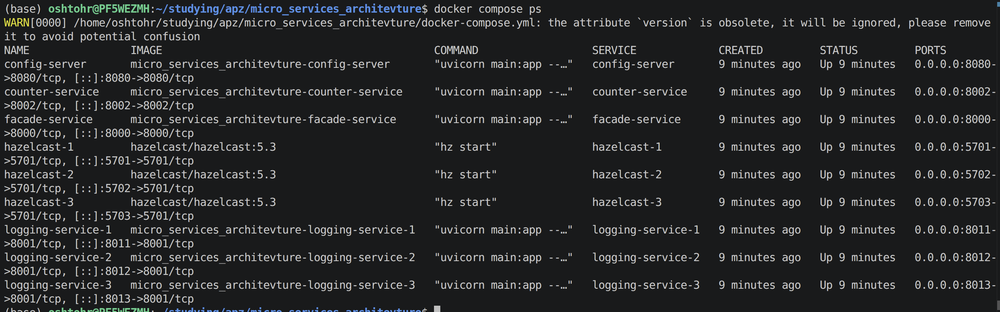

### POST 10 transactions:
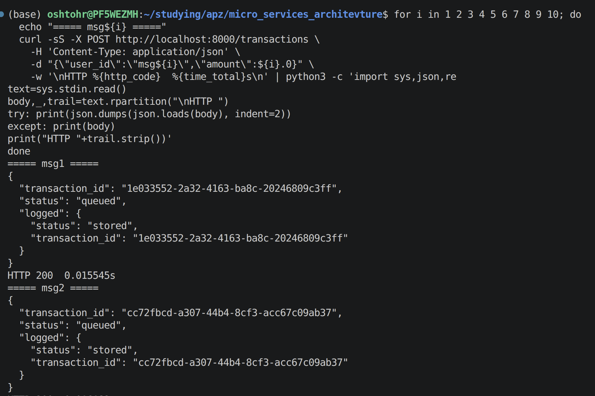
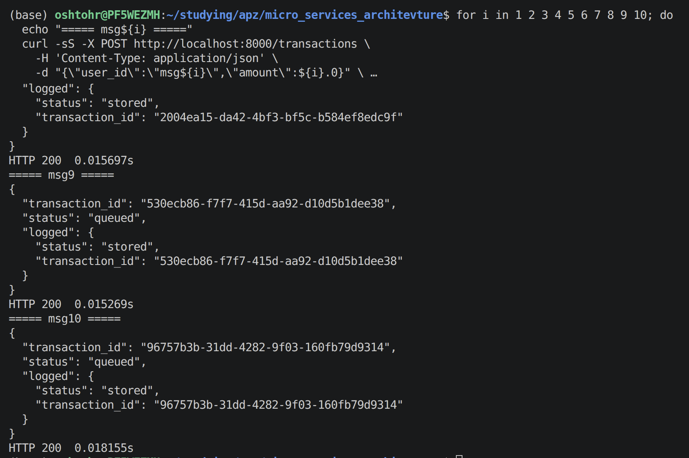

### Different logging-service instances receive messages:
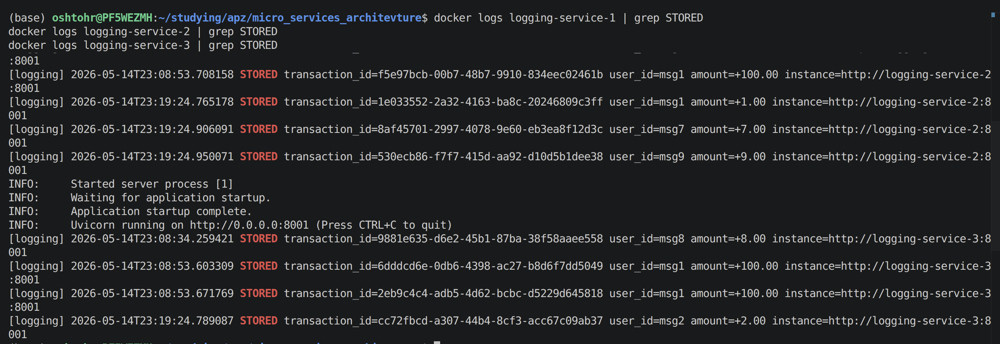

### Counter-service consumed all messages from the MQ:
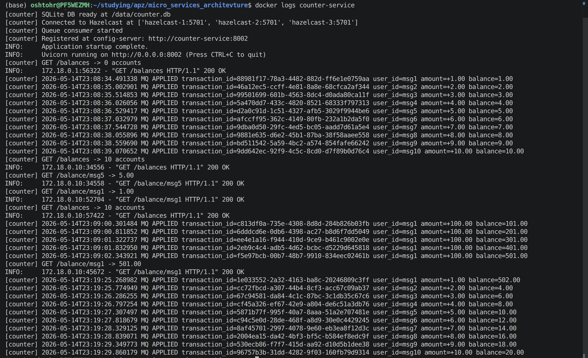

### GET reads via facade:
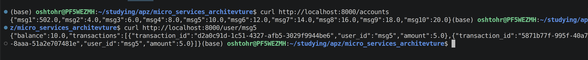

### Fault tolerance - pause + POST:
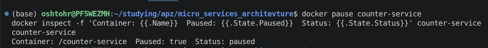
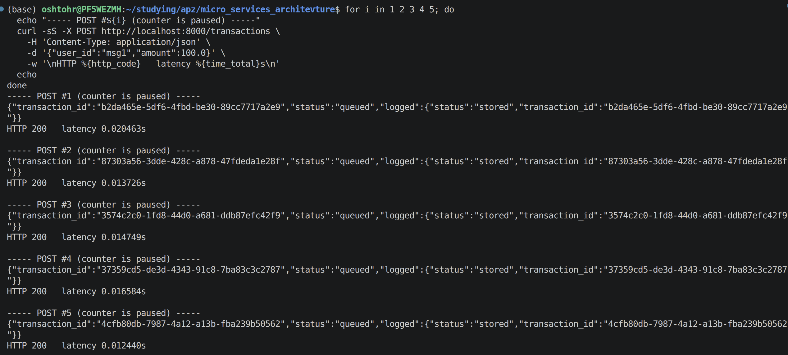
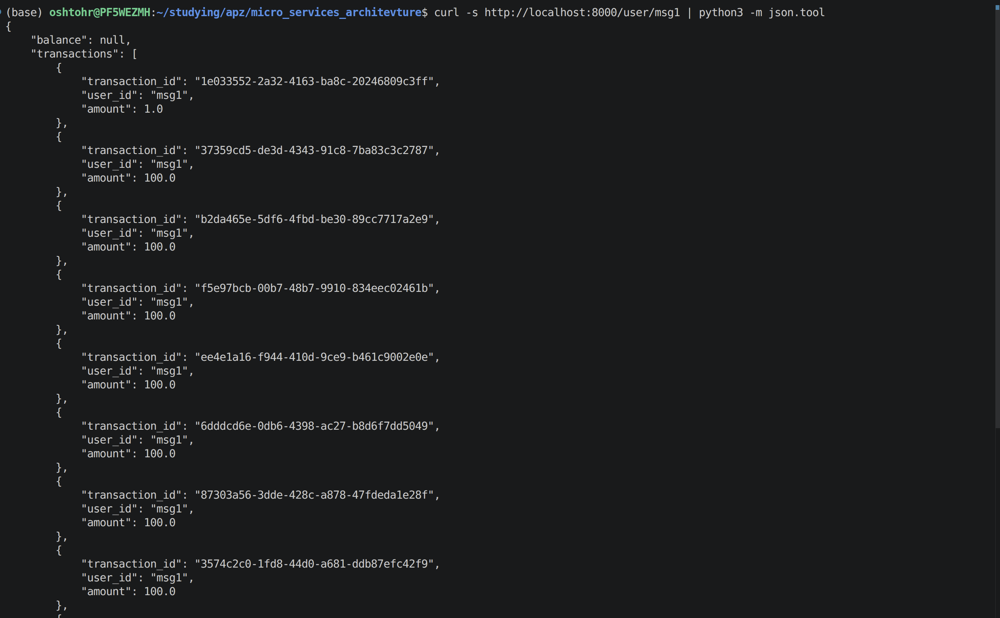
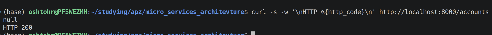

### Fault tolerance - unpause + drain:
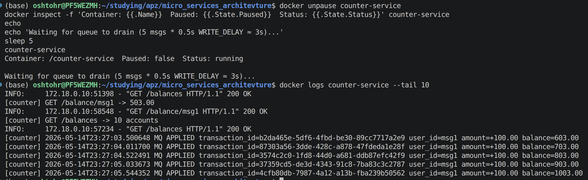
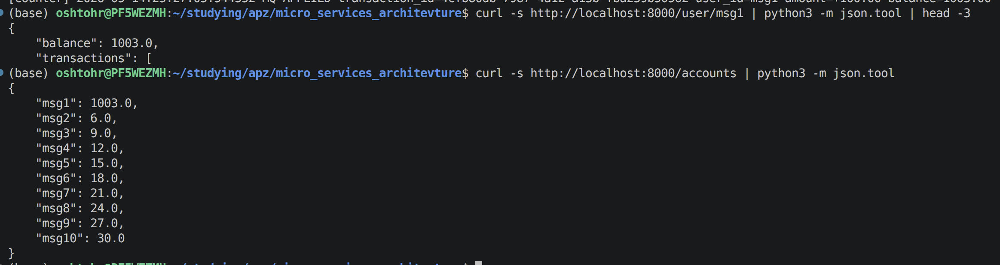
