# Microservices with Consul — Banking System

FastAPI microservices implementing a banking transaction system using **Consul** as Service Register, Service Discovery, and Config Server, with a **Hazelcast** distributed map and message queue, and **PostgreSQL** as persistent storage for account balances in `counter-service`.

## Services

| Service | Internal port | Host port(s) |
|---|---|---|
| `facade-service` | 8000 | 8000 |
| `logging-service` ×3 | 8001 | 8011, 8012, 8013 |
| `counter-service` | 8002 | 8002 |
| `consul` | 8500 | 8500 |
| `hazelcast-1/2/3` | 5701 | 5701, 5702, 5703 |
| `postgres` | 5432 | 5432 |

## Architecture

```
Client
  │
  ▼ HTTP POST/GET
Facade-service ◄──► Consul (service discovery + KV config)
  │  │                      ▲           ▲           ▲
  │  │ HTTP POST (log)       │           │           │
  │  └─────────────────► logging-svc ×3 │      counter-svc
  │                      (registers)    │      (registers)
  │ Hazelcast Queue (MQ)                │
  └─────────────────────────────────► counter-service ──► PostgreSQL
                                      (consumes from queue,    (balances)
                                       persists balances)
                HZ cluster (3 nodes) ◄── shared distributed map
```

### Consul roles

| Role | What it does |
|---|---|
| **Service Register** | All services (`facade`, `logging` ×3, `counter`) register themselves on startup with an HTTP health check |
| **Service Discovery** | `facade-service` calls `consul.health.service(name, passing=True)` to get a live list of healthy instances and picks one at random |
| **Config KV** | Hazelcast and MQ settings stored as key/value pairs; services read these at startup instead of using hardcoded env vars |

### Consul KV store

| Key | Value | Read by |
|---|---|---|
| `config/hazelcast/hosts` | `hazelcast-1:5701,hazelcast-2:5701,hazelcast-3:5701` | `logging-service` |
| `config/hazelcast/cluster_name` | `dev` | `logging-service` |
| `config/hazelcast/map_name` | `logging-messages` | `logging-service` |
| `config/mq/hosts` | `hazelcast-1:5701,hazelcast-2:5701,hazelcast-3:5701` | `facade-service`, `counter-service` |
| `config/mq/cluster_name` | `dev` | `facade-service`, `counter-service` |
| `config/mq/queue_name` | `counter-transactions` | `facade-service`, `counter-service` |
| `config/db/host` | `postgres` | `counter-service` |
| `config/db/port` | `5432` | `counter-service` |
| `config/db/user` | `counter` | `counter-service` |
| `config/db/password` | `counter_pwd` | `counter-service` |
| `config/db/name` | `counterdb` | `counter-service` |

The `consul-init` container seeds all keys on first boot and then exits.

### Facade Service (port 8000)

| Method | Endpoint | Description |
|---|---|---|
| `POST` | `/transactions` | Log transaction + enqueue to counter-service MQ |
| `GET` | `/user/{user_id}` | Balance + transaction history |
| `GET` | `/accounts` | All account balances |
| `GET` | `/stats` | Accumulated call times to downstream services |
| `POST` | `/stats/reset` | Reset timing accumulators |
| `GET` | `/health` | Health check (used by Consul) |

On `POST /transactions` the facade:
1. Queries Consul for healthy `logging-service` instances, picks one at random, calls `POST /log` (synchronous).
2. Puts the transaction JSON into the Hazelcast `counter-transactions` queue (fire-and-forget).

### Logging Service (ports 8011–8013, 3 instances)

Stores transactions in a **Hazelcast distributed map** (`logging-messages`) shared across all instances.

| Method | Endpoint | Description |
|---|---|---|
| `POST` | `/log` | Store `{transaction_id, user_id, amount}` (deduplication by `transaction_id`) |
| `GET` | `/messages` | All stored transactions |
| `GET` | `/user/{user_id}` | Transactions for one user |
| `GET` | `/health` | Health check (used by Consul) |

### Counter Service (port 8002)

Runs a background thread that **consumes** from the Hazelcast `counter-transactions` queue and persists balances to a **PostgreSQL** database. DB connection settings are read from Consul KV (`config/db/*`). The schema is initialized at startup:

```sql
CREATE TABLE balances (
    user_id  TEXT PRIMARY KEY,
    balance  NUMERIC NOT NULL DEFAULT 0
);
CREATE TABLE processed_transactions (
    transaction_id  TEXT PRIMARY KEY,
    user_id         TEXT NOT NULL,
    amount          NUMERIC NOT NULL,
    processed_at    TIMESTAMPTZ NOT NULL DEFAULT NOW()
);
```

Transactions are applied as an atomic upsert with a `processed_transactions` dedup guard so that re-delivery from the MQ does not double-count.

| Method | Endpoint | Description |
|---|---|---|
| `GET` | `/balance/{user_id}` | Balance for one user (`SELECT` from `balances`) |
| `GET` | `/balances` | All account balances |
| `GET` | `/health` | Health check (used by Consul) |

### Hazelcast Cluster (3 nodes, ports 5701–5703)

Provides both the **distributed map** (logging-service) and the **distributed queue** (MQ between facade and counter).

## Running

```bash
docker compose up --build
```

To stop and clean up:

```bash
docker compose down
```

## Verification Output

### 1. All services registered in Consul (healthy)

```
$ curl -s http://localhost:8500/v1/health/state/passing | python3 -m json.tool | grep -E '"ServiceName"|"ServiceID"'
        "ServiceID": "",
        "ServiceName": "",
        "ServiceID": "counter-service-counter-service",
        "ServiceName": "counter-service",
        "ServiceID": "facade-service-facade-service",
        "ServiceName": "facade-service",
        "ServiceID": "logging-service-logging-service-1",
        "ServiceName": "logging-service",
        "ServiceID": "logging-service-logging-service-2",
        "ServiceName": "logging-service",
        "ServiceID": "logging-service-logging-service-3",
        "ServiceName": "logging-service",
```

All 5 service instances are passing health checks. The empty `ServiceID`/`ServiceName` entry is the Consul node itself.

### 2. Consul KV store (config seeded by consul-init)

Values are base64-encoded by the Consul API (decoded values shown in comments):

```
$ curl -s 'http://localhost:8500/v1/kv/config?recurse=true' | python3 -m json.tool
[
    { "Key": "config/hazelcast/cluster_name", "Value": "ZGV2"              },  // dev
    { "Key": "config/hazelcast/hosts",        "Value": "aGF6ZWxjYXN0..."  },  // hazelcast-1:5701,hazelcast-2:5701,hazelcast-3:5701
    { "Key": "config/hazelcast/map_name",     "Value": "bG9nZ2luZy1..."   },  // logging-messages
    { "Key": "config/mq/cluster_name",        "Value": "ZGV2"              },  // dev
    { "Key": "config/mq/hosts",               "Value": "aGF6ZWxjYXN0..."  },  // hazelcast-1:5701,hazelcast-2:5701,hazelcast-3:5701
    { "Key": "config/mq/queue_name",          "Value": "Y291bnRlci0..."   }   // counter-transactions
]
```

### 3. POST transactions

```
$ curl -s -X POST http://localhost:8000/transactions \
    -H 'Content-Type: application/json' \
    -d '{"user_id": "alice", "amount": 100.0}' | python3 -m json.tool
{
    "transaction_id": "d6c46649-c623-4427-a09e-02a3b1088b4f",
    "status": "queued",
    "logged": {
        "status": "stored",
        "transaction_id": "d6c46649-c623-4427-a09e-02a3b1088b4f"
    }
}

$ curl -s -X POST http://localhost:8000/transactions \
    -H 'Content-Type: application/json' \
    -d '{"user_id": "bob", "amount": 50.0}' | python3 -m json.tool
{
    "transaction_id": "e956dc76-60ef-4fb5-ac6f-38678023ed1c",
    "status": "queued",
    "logged": {
        "status": "stored",
        "transaction_id": "e956dc76-60ef-4fb5-ac6f-38678023ed1c"
    }
}
```

### 4. GET user balance and all accounts

```
$ curl -s http://localhost:8000/user/alice | python3 -m json.tool
{
    "balance": 100.0,
    "transactions": [
        {
            "transaction_id": "d6c46649-c623-4427-a09e-02a3b1088b4f",
            "user_id": "alice",
            "amount": 100.0
        }
    ]
}

$ curl -s http://localhost:8000/accounts | python3 -m json.tool
{
    "alice": 100.0,
    "bob": 50.0
}
```

### 5. Fault-tolerance demo — instance failure redirected automatically

```
$ sudo docker stop logging-service-2
logging-service-2

$ sleep 12   # Consul marks it critical after health check interval

$ curl -s -X POST http://localhost:8000/transactions \
    -H 'Content-Type: application/json' \
    -d '{"user_id": "alice", "amount": 10.0}' | python3 -m json.tool
{
    "transaction_id": "f9be60da-16d9-4259-b541-ad26e90df4c9",
    "status": "queued",
    "logged": {
        "status": "stored",
        "transaction_id": "f9be60da-16d9-4259-b541-ad26e90df4c9"
    }
}

$ sudo docker start logging-service-2
logging-service-2
```

Request succeeded with `logging-service-2` down — Consul only returned healthy instances (`logging-service-1` and `logging-service-3`), so the facade routed to one of those automatically.

### 6. Performance tests

The PDF requires running two scenarios from Task 1 and comparing the result against the
prior labs. We scaled the load up to **10 concurrent clients × 100 requests each = 1000
POSTs followed by 1000 GETs per scenario** so the table reflects steady-state behavior
rather than a 10-request sample. The two scenarios are:

- **Scenario 1 — 10 separate accounts**: each client posts to its own `user_{i}`.
- **Scenario 2 — 1 shared account**: all 10 clients post to `shared_user`.

The benchmark script lives at [`perf/bench_full.py`](perf/bench_full.py) and is reproducible:

```bash
# Task 5 — current branch (this README)
docker compose up --build -d
sleep 20
python3 perf/bench_full.py --scenario 1 --clients 10 --per-client 100
python3 perf/bench_full.py --scenario 2 --clients 10 --per-client 100
```

For the historical numbers the same script was re-run against:

- **Task 1 (in-mem)** — `micro_basics` branch unchanged.
- **Task 3 (DB)** — `micro_basics` branch with `counter-service` rewritten to persist
  balances in PostgreSQL (still synchronous HTTP from facade — no MQ).
- **Task 5 (final)** — this branch: Consul service-discovery + KV config, Hazelcast
  distributed map (logging-service), Hazelcast queue (facade → counter-service),
  PostgreSQL inside counter-service.

Each scenario does 1000 POSTs then 1000 GETs, so each downstream service is called 2000
times in total. The facade accumulates per-downstream-call timing in `/stats`. The
`*_contribution` rows below are the **total time the facade spent waiting on that service
across all 2000 calls** of the scenario.

#### Raw output — Task 5 (final, this branch)

```
$ python3 perf/bench_full.py --scenario 1 --clients 10 --per-client 100
=== Scenario 1 (10 separate accounts) — 10 clients x 100 = 1000 requests ===

  POST /transactions:
    total           : 1000  (ok=1000)
    wall_time_s     : 12.336
    rps             : 81.1
    avg_latency_ms  : 122.23
    median_lat_ms   : 126.34
    min/max ms      : 20.85 / 192.16
  GET /user/{id}:
    total           : 1000  (ok=1000)
    wall_time_s     : 17.423
    rps             : 57.4
    avg_latency_ms  : 171.45
    median_lat_ms   : 166.87
    min/max ms      : 52.59 / 378.35

  TOTAL wall time (POST+GET): 29.759s

  Downstream contributions (from facade /stats):
    logging-service : 2000 calls, total=142.345s, avg=71.17ms
    counter-service : 1000 calls, total=45.655s, avg=45.66ms

$ python3 perf/bench_full.py --scenario 2 --clients 10 --per-client 100
=== Scenario 2 (1 shared account) — 10 clients x 100 = 1000 requests ===

  POST /transactions:
    total           : 1000  (ok=1000)
    wall_time_s     : 11.789
    rps             : 84.8
    avg_latency_ms  : 116.35
    median_lat_ms   : 121.34
    min/max ms      : 20.80 / 203.88
  GET /user/{id}:
    total           : 1000  (ok=1000)
    wall_time_s     : 36.622
    rps             : 27.3
    avg_latency_ms  : 360.18
    median_lat_ms   : 362.18
    min/max ms      : 78.47 / 668.07

  TOTAL wall time (POST+GET): 48.411s

  Downstream contributions (from facade /stats):
    logging-service : 2000 calls, total=227.671s, avg=113.84ms
    counter-service : 1000 calls, total=79.445s, avg=79.45ms
```

> Note: in Task 5 the POST path no longer waits on `counter-service` synchronously — it
> just enqueues to the Hazelcast MQ. So the 2000-call sequence (1000 POST + 1000 GET)
> only contributes **1000 calls** to `counter-service` (the GET phase), while
> `logging-service` is still hit twice per transaction (POST + GET) → 2000 calls.

#### Raw output — Task 3 (DB) — `micro_basics` branch + Postgres in counter-service

```
$ python3 perf/bench_full.py --scenario 1 --clients 10 --per-client 100
=== Scenario 1 (10 separate accounts) — 10 clients x 100 = 1000 requests ===

  POST /transactions:
    total           : 1000  (ok=1000)
    wall_time_s     : 8.757
    rps             : 114.2
    avg_latency_ms  : 86.36
    median_lat_ms   : 86.23
    min/max ms      : 11.70 / 216.79
  GET /user/{id}:
    total           : 1000  (ok=1000)
    wall_time_s     : 6.904
    rps             : 144.9
    avg_latency_ms  : 68.50
    median_lat_ms   : 68.66
    min/max ms      : 7.83 / 152.24

  TOTAL wall time (POST+GET): 15.661s

  Downstream contributions (from facade /stats):
    logging-service : 2000 calls, total=60.692s, avg=30.35ms
    counter-service : 2000 calls, total=72.031s, avg=36.02ms

$ python3 perf/bench_full.py --scenario 2 --clients 10 --per-client 100
=== Scenario 2 (1 shared account) — 10 clients x 100 = 1000 requests ===

  POST /transactions:
    total           : 1000  (ok=1000)
    wall_time_s     : 8.776
    rps             : 113.9
    avg_latency_ms  : 86.55
    median_lat_ms   : 81.30
    min/max ms      : 11.87 / 175.11
  GET /user/{id}:
    total           : 1000  (ok=1000)
    wall_time_s     : 8.585
    rps             : 116.5
    avg_latency_ms  : 85.59
    median_lat_ms   : 73.72
    min/max ms      : 40.21 / 194.77

  TOTAL wall time (POST+GET): 17.361s

  Downstream contributions (from facade /stats):
    logging-service : 2000 calls, total=84.108s, avg=42.05ms
    counter-service : 2000 calls, total=86.066s, avg=43.03ms
```

#### Raw output — Task 1 (in-mem) — `micro_basics` branch unchanged

```
$ python3 perf/bench_full.py --scenario 1 --clients 10 --per-client 100
=== Scenario 1 (10 separate accounts) — 10 clients x 100 = 1000 requests ===

  POST /transactions:
    total           : 1000  (ok=1000)
    wall_time_s     : 6.383
    rps             : 156.7
    avg_latency_ms  : 63.31
    median_lat_ms   : 62.67
    min/max ms      : 12.32 / 153.23
  GET /user/{id}:
    total           : 1000  (ok=1000)
    wall_time_s     : 5.694
    rps             : 175.6
    avg_latency_ms  : 56.41
    median_lat_ms   : 51.35
    min/max ms      : 10.08 / 172.66

  TOTAL wall time (POST+GET): 12.078s

  Downstream contributions (from facade /stats):
    logging-service : 2000 calls, total=59.416s, avg=29.71ms
    counter-service : 2000 calls, total=58.461s, avg=29.23ms

$ python3 perf/bench_full.py --scenario 2 --clients 10 --per-client 100
=== Scenario 2 (1 shared account) — 10 clients x 100 = 1000 requests ===

  POST /transactions:
    total           : 1000  (ok=1000)
    wall_time_s     : 7.484
    rps             : 133.6
    avg_latency_ms  : 74.34
    median_lat_ms   : 70.96
    min/max ms      : 16.65 / 170.76
  GET /user/{id}:
    total           : 1000  (ok=1000)
    wall_time_s     : 8.714
    rps             : 114.8
    avg_latency_ms  : 86.88
    median_lat_ms   : 72.98
    min/max ms      : 45.74 / 197.60

  TOTAL wall time (POST+GET): 16.198s

  Downstream contributions (from facade /stats):
    logging-service : 2000 calls, total=91.285s, avg=45.64ms
    counter-service : 2000 calls, total=80.312s, avg=40.16ms
```

#### Performance comparison across labs (1000 POST + 1000 GET per cell)

| Test scenarios |                                  | Task 1 (in-mem) | Task 3 (DB) | Task 5 (final) |
|---|---|---|---|---|
| **10 accounts** | Total time (POST+GET wall)                 | **12.08 s** (156.7 + 175.6 rps) | **15.66 s** (114.2 + 144.9 rps) | **29.76 s** (81.1 + 57.4 rps) |
|                 | logging-service contribution               | 59.42 s / 2000 calls (avg 29.7 ms) | 60.69 s / 2000 calls (avg 30.4 ms) | 142.35 s / 2000 calls (avg 71.2 ms) |
|                 | counter-service contribution               | 58.46 s / 2000 calls (avg 29.2 ms) | 72.03 s / 2000 calls (avg 36.0 ms) | 45.66 s / 1000 calls (avg 45.7 ms — POSTs async via MQ) |
| **1 account**   | Total time (POST+GET wall)                 | **16.20 s** (133.6 + 114.8 rps) | **17.36 s** (113.9 + 116.5 rps) | **48.41 s** (84.8 + 27.3 rps) |
|                 | logging-service contribution               | 91.29 s / 2000 calls (avg 45.6 ms) | 84.11 s / 2000 calls (avg 42.1 ms) | 227.67 s / 2000 calls (avg 113.8 ms) |
|                 | counter-service contribution               | 80.31 s / 2000 calls (avg 40.2 ms) | 86.07 s / 2000 calls (avg 43.0 ms) | 79.45 s / 1000 calls (avg 79.5 ms — POSTs async via MQ) |

Observations:

1. **Task 1 → Task 3** is mostly flat: switching the counter-service from in-memory to
   PostgreSQL adds only ≈ 6 ms/call on the counter-service path (36.0 ms vs. 29.2 ms in
   scenario 1). Logging-service is unchanged because it still keeps state in process
   memory in Task 3.
2. **Task 3 → Task 5** is where the cost shows up: per-call `logging-service` latency
   roughly **doubles** (30 → 71 ms in scenario 1, 42 → 114 ms in scenario 2). Two reasons —
   each `POST /log` now writes to a 3-node Hazelcast distributed map (extra serialization
   + replication), and the facade does a Consul service-discovery lookup on every request
   to choose a healthy instance.
3. **MQ shifts work off the critical path, not out of the system.** In Task 5 the facade
   only does 1000 (not 2000) counter-service calls — POSTs go through the Hazelcast MQ
   instead of waiting on counter-service synchronously. The DB upsert still happens, it
   just happens in the counter-service's consumer thread, asynchronously.
4. **Scenario 2 (1 shared account) is consistently slower than scenario 1** in every task.
   With 10 clients all posting/reading the same `user_id`, requests stack on the same
   Hazelcast queue/map entry and the same Postgres row → less parallelism. The effect is
   biggest in Task 5 (GET phase drops from 57.4 to 27.3 rps) because the GET path goes
   logging → counter and both are now bottlenecked on a single hot key.
5. **Total wall time grows ≈ 2× from Task 1 to Task 5** for scenario 1, and ≈ 3× for
   scenario 2. The added latency is the price paid for fault tolerance + horizontal
   scalability + persistence: 3 logging instances behind Consul, an MQ between facade and
   counter, and a durable PostgreSQL store for balances. Nothing about the DB write itself
   slowed the request path down — the DB upsert is now off the POST critical path
   entirely.

## Consul UI

Open **http://localhost:8500** in a browser to see:
- All registered services with instance counts and health status
- Key/Value store with the config entries
- Real-time health check results

## Project Structure

```
micro_services_architevture/
├── docker-compose.yml          # +postgres service, +consul KV seeds for config/db/*
├── hazelcast/
│   └── hazelcast.xml          # TCP/IP cluster discovery config
├── facade-service/
│   ├── Dockerfile
│   ├── requirements.txt
│   └── main.py                # Consul discovery + MQ config from KV
├── logging-service/
│   ├── Dockerfile
│   ├── requirements.txt
│   └── main.py                # Consul registration + HZ config from KV
├── counter-service/
│   ├── Dockerfile
│   ├── requirements.txt        # +psycopg2-binary
│   └── main.py                # Consul registration + MQ/DB config from KV; PG balances persistence
└── perf/
    ├── bench.py            # original benchmark (POST-only; --scenario 1/2)
    └── bench_full.py       # POST + GET combined benchmark used for the table above
```

## Screenshots


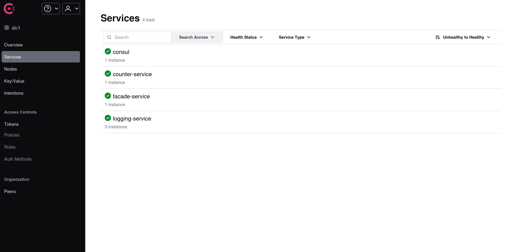
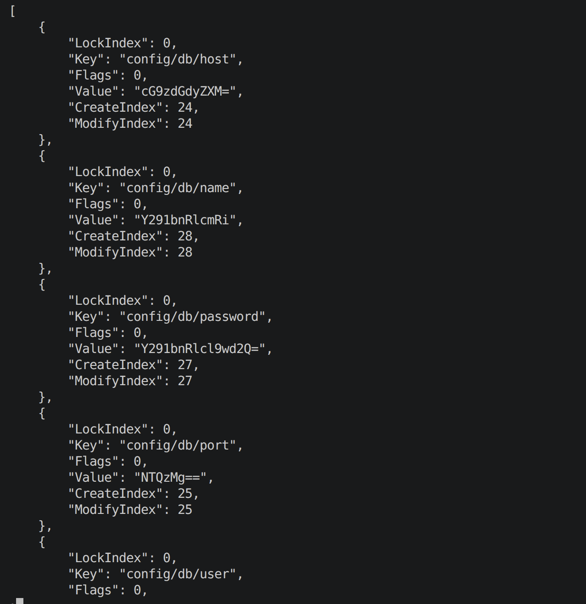
curl -s 'http://localhost:8500/v1/kv/config?recurse=true' | python3 -m json.tool | less
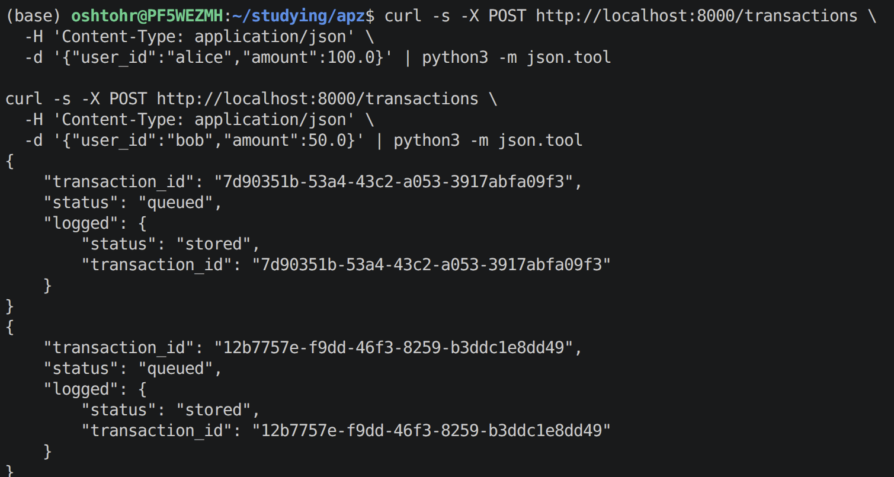
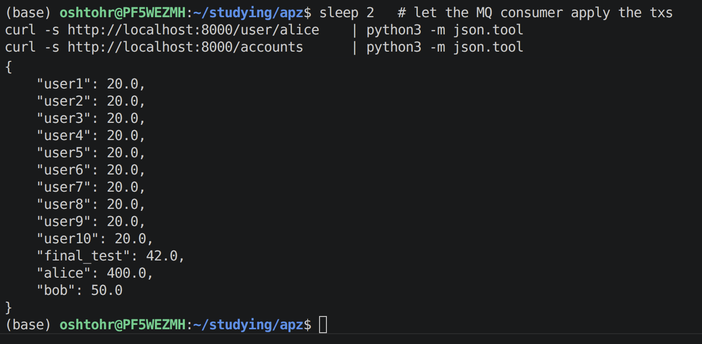

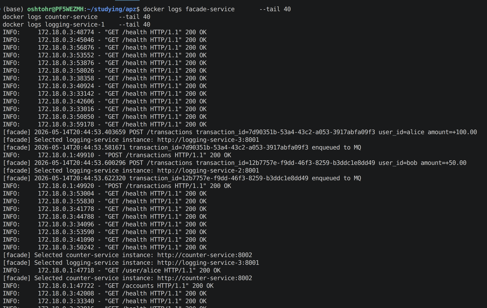
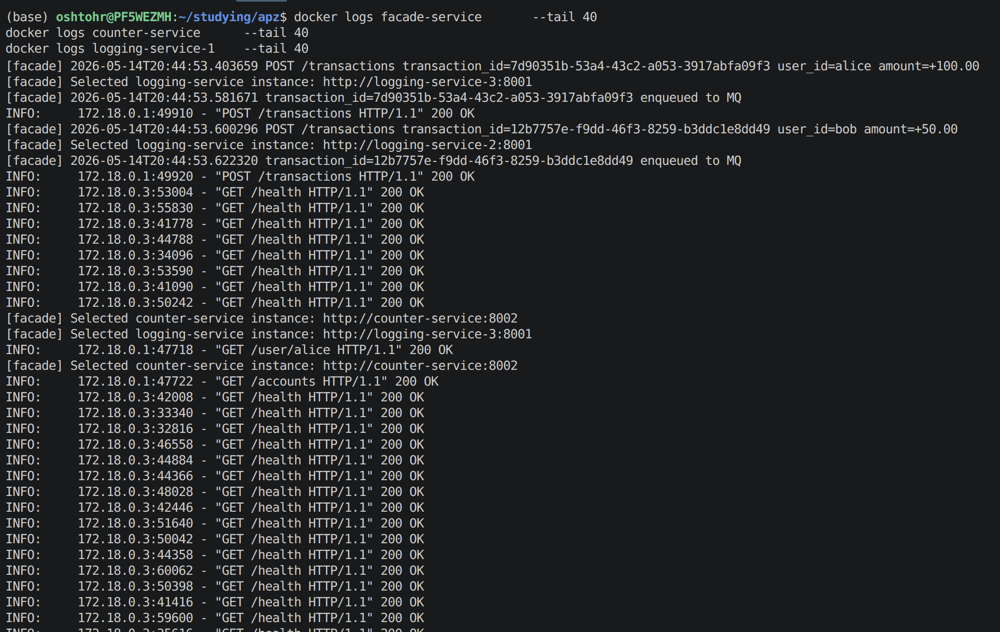
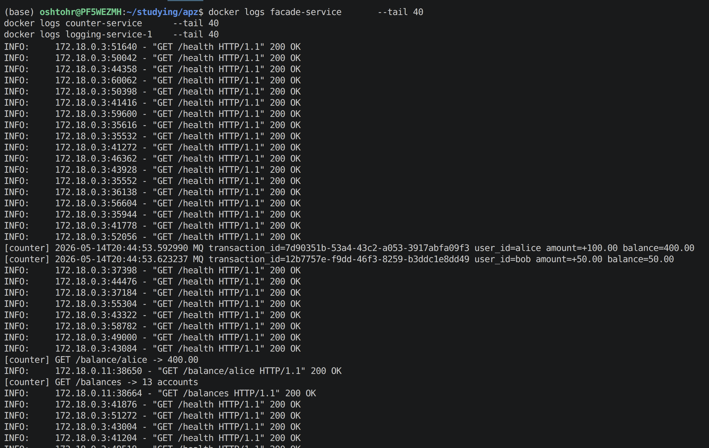
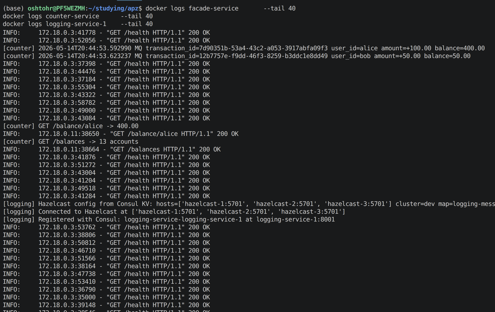
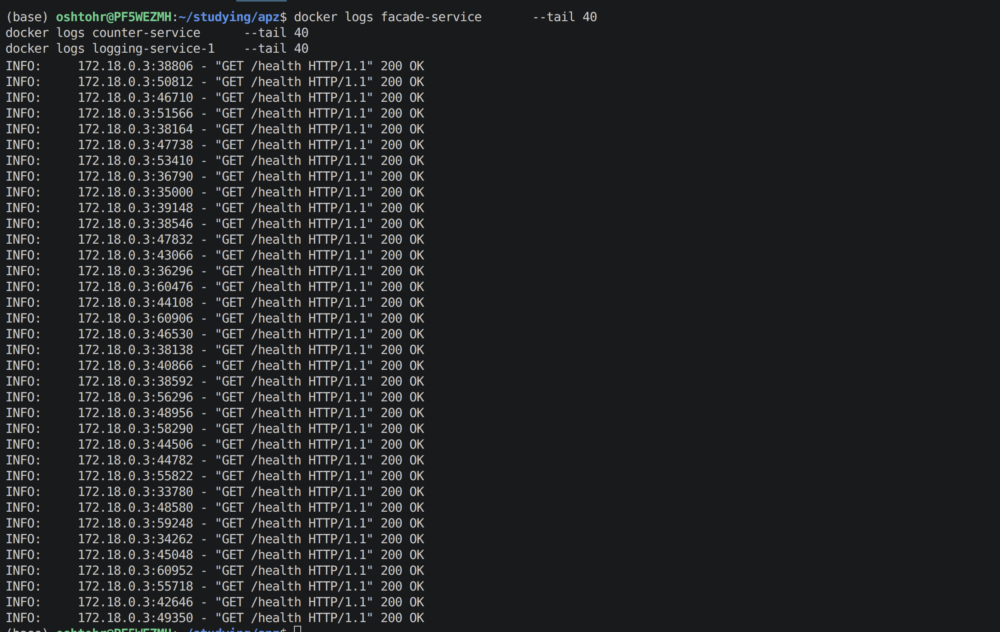
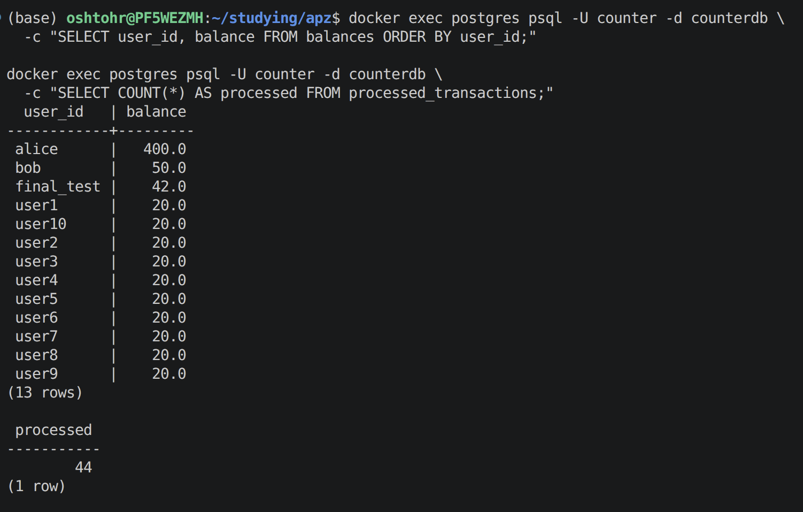


## Fault tolerance:
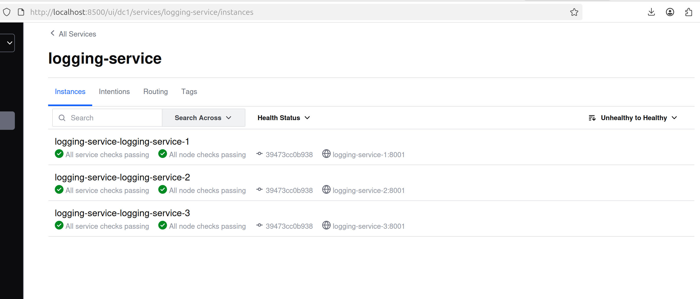
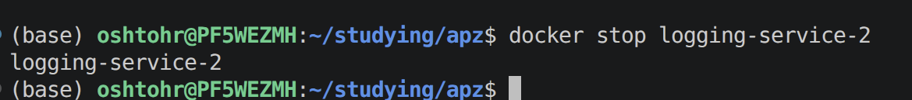
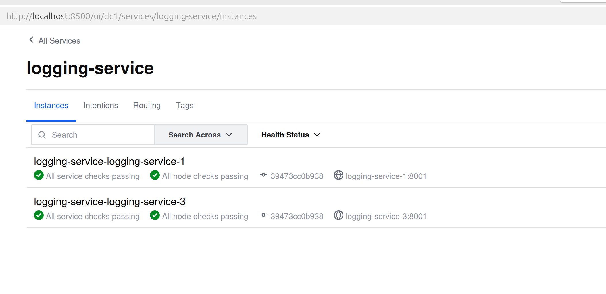
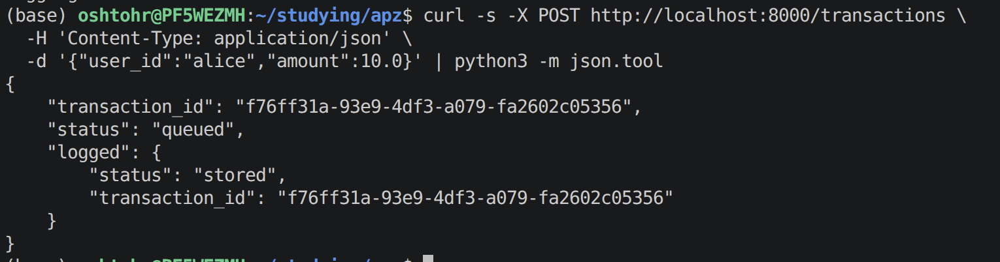
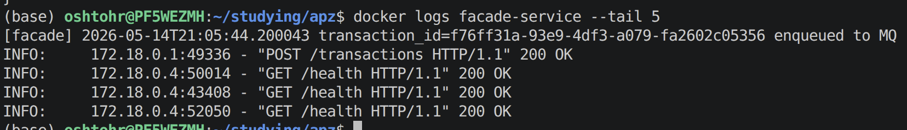