# Microservices Basics — Banking System

Three FastAPI microservices implementing a basic banking transaction system. Each service runs in its own Docker container managed via Docker Compose.

- `facade-service` (port 8000)
- `logging-service` (port 8001)
- `counter-service` (port 8002)

## Running with Docker Compose

```bash
docker compose up --build
```

To stop:

```bash
docker compose down
```

## Architecture

### Facade Service (port 8000)
Gateway that handles all client requests and fans out to downstream services.

| Method | Endpoint | Description |
|--------|----------|-------------|
| `POST` | `/transactions` | Submit a transaction `{user_id, amount}` |
| `GET`  | `/user/{user_id}` | Get balance + transaction history for a user |
| `GET`  | `/accounts` | Get balances for all accounts |
| `GET`  | `/stats` | Accumulated call time to logging/counter services |
| `POST` | `/stats/reset` | Reset timing accumulators |

On `POST /transactions` the facade generates a `transaction_id`, then forwards the full transaction to logging-service and counter-service **concurrently**, and returns `{transaction_id, balance}`.

### Logging Service (port 8001)
Stores all transactions in memory using `transaction_id` as key (deduplication built-in).

| Method | Endpoint | Description |
|--------|----------|-------------|
| `POST` | `/log` | Store `{transaction_id, user_id, amount}` |
| `GET`  | `/messages` | Return all stored transactions |
| `GET`  | `/user/{user_id}` | Return transactions for one user |

### Counter Service (port 8002)
Maintains per-user account balances in memory (`user_id → balance`).

| Method | Endpoint | Description |
|--------|----------|-------------|
| `POST` | `/transaction` | Apply credit/debit, return updated balance |
| `GET`  | `/balance/{user_id}` | Get balance for one user |
| `GET`  | `/balances` | Get all account balances |

## Example Usage

**Submit transactions:**
```bash
curl -X POST http://localhost:8000/transactions \
  -H 'Content-Type: application/json' \
  -d '{"user_id": "alice", "amount": 100.0}'

curl -X POST http://localhost:8000/transactions \
  -H 'Content-Type: application/json' \
  -d '{"user_id": "alice", "amount": -30.0}'

curl -X POST http://localhost:8000/transactions \
  -H 'Content-Type: application/json' \
  -d '{"user_id": "bob", "amount": 50.0}'
```

**Check results:**
```bash
# alice's balance + full transaction history
curl http://localhost:8000/user/alice

# all account balances
curl http://localhost:8000/accounts

# timing stats for downstream services
curl http://localhost:8000/stats
```

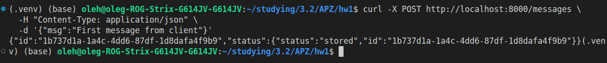
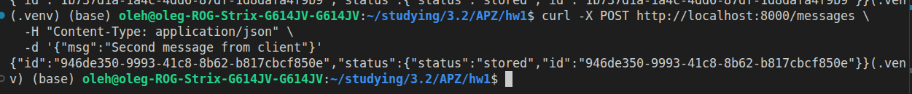
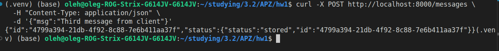
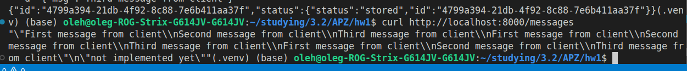

## Performance Testing

`perf/bench.py` runs concurrent clients against the facade and measures throughput and latency. After the run it fetches `/accounts` to verify correctness and `/stats` for downstream timing breakdown.

**Scenario 1** — 10 clients each posting 10K transactions to their own account (expected: 10 accounts × balance 10 000):
```bash
python perf/bench.py --scenario 1 --clients 10 --per-client 10000
```

**Scenario 2** — 10 clients each posting 10K transactions to one shared account (expected: 1 account with balance 100 000):
```bash
python perf/bench.py --scenario 2 --clients 10 --per-client 10000
```

**Custom load:**
```bash
python perf/bench.py \
  --url http://localhost:8000/transactions \
  --data '{"user_id":"alice","amount":1.0}' \
  --clients 5 --per-client 200
```

Metrics reported: total requests, successful responses, wall time, RPS, avg/median/min/max latency, and per-service call counts and average times from `/stats`.

High load:
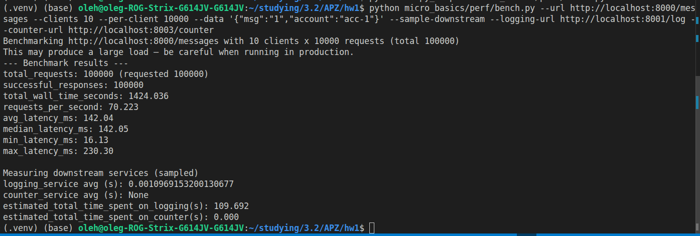
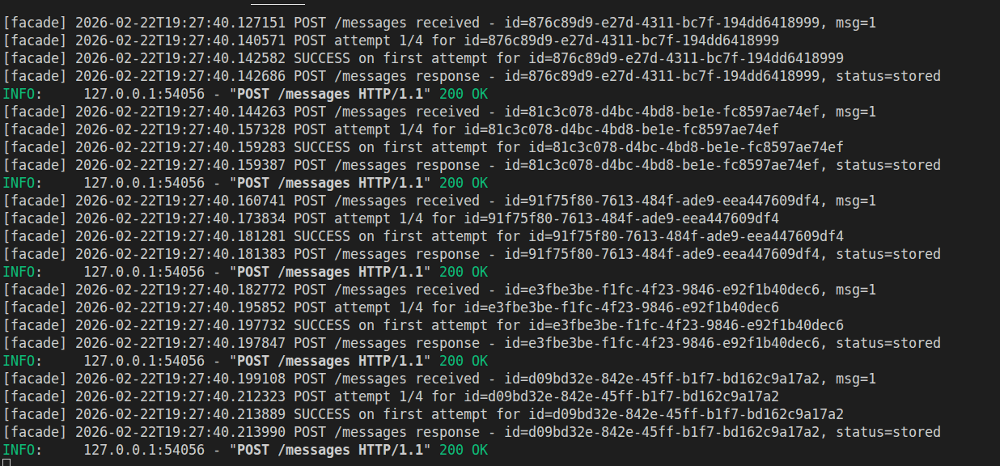
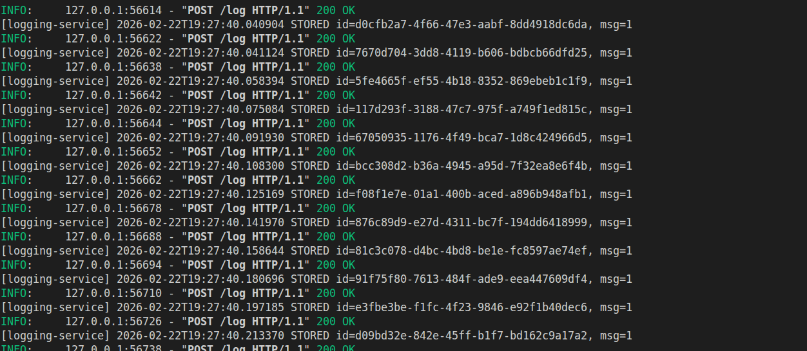

Scenario 1:
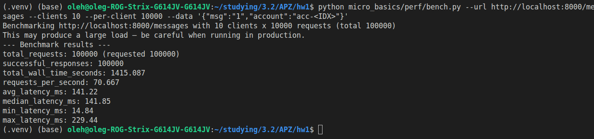
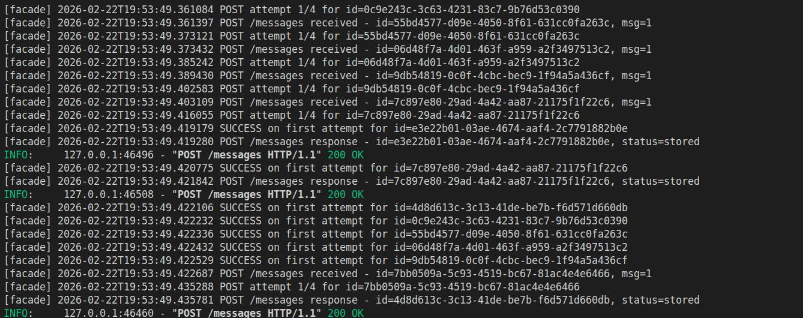
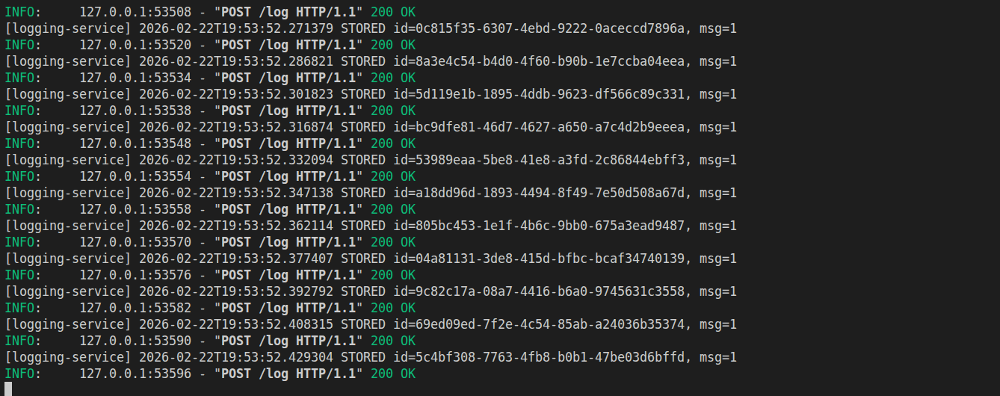

Scenario 2:
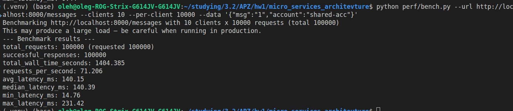
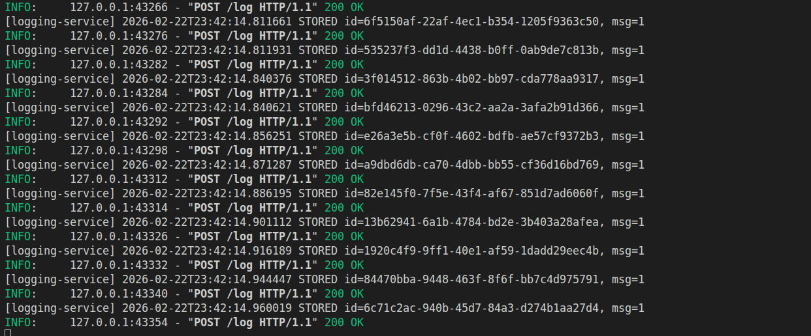
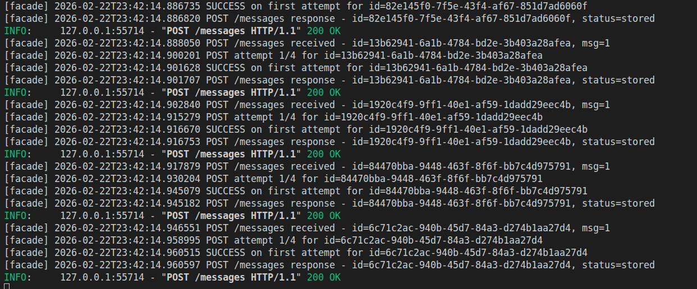

## Project Structure

```
micro_services_architevture/
├── docker-compose.yml
├── facade-service/
│   ├── Dockerfile
│   ├── requirements.txt
│   └── main.py
├── logging-service/
│   ├── Dockerfile
│   ├── requirements.txt
│   └── main.py
├── counter-service/
│   ├── Dockerfile
│   ├── requirements.txt
│   └── main.py
└── perf/
    └── bench.py
```
