# Lab 3 — Microservices with Hazelcast Distributed Map

Three FastAPI microservices + a 3-node **Hazelcast** cluster + **PostgreSQL**.

- `facade-service` (port `8000`) — entry-point; randomly picks one of the 3 logging-service instances, with automatic failover to the next on error.
- `logging-service` — runs in **3 instances** (`logging-service-1/2/3`, host ports `8011/8012/8013`); stores messages in a Hazelcast **Distributed Map** named `messages`. Each instance connects to **its own** Hazelcast node (ls-1→hz-1, ls-2→hz-2, ls-3→hz-3) using the Python client in unisocket mode (`smart_routing=False`, `shuffle_member_list=False`). The full member list is configured as fallback so the client transparently reconnects to a surviving HZ node if its primary dies.
- `counter-service` (port `8002`) — stores per-user balances in **PostgreSQL** (`balances` table, atomic `INSERT … ON CONFLICT … DO UPDATE` upsert).
- `hazelcast-1/2/3` (host ports `5701/5702/5703`) — 3-node Hazelcast cluster, TCP-IP discovery, `messages` map with `backup-count: 1`.
- `postgres` (port `5432`) — Postgres 16 with a persistent volume.

## Architecture

```
                           ┌──────────────┐
                           │ Hazelcast-1  │◄──┐
                           ├──────────────┤   │ TCP-IP cluster
                           │ Hazelcast-2  │◄──┤ (cluster-name: dev-cluster)
                           ├──────────────┤   │
                           │ Hazelcast-3  │◄──┘
                           └──────▲───────┘
                                  │ Hazelcast Python client
                                  │ (Distributed Map "messages")
        ┌─────────────────────────┼─────────────────────────┐
        │                         │                         │
┌───────┴────────┐       ┌────────┴───────┐        ┌────────┴───────┐
│ logging-svc-1  │       │ logging-svc-2  │        │ logging-svc-3  │
│ primary→HZ-1   │       │ primary→HZ-2   │        │ primary→HZ-3   │
└───────▲────────┘       └────────▲───────┘        └────────▲───────┘
        │                         │                         │
        └─────────────┐ HTTP ┌────┘                         │
                      │      │                              │
                      ▼      ▼                              │
client ──HTTP──► facade-service  ◄──── randomly chooses one,
                      │ failover to the next on error
                      │
                      ▼
                counter-service ──SQL──► PostgreSQL (balances)
```

## Running

```bash
docker compose up --build -d
```

Stop:

```bash
docker compose down -v
```

## Endpoints

### facade-service (`http://localhost:8000`)

| Method | Endpoint            | Description                                                                  |
|--------|---------------------|------------------------------------------------------------------------------|
| `POST` | `/transactions`     | `{user_id, amount}` → fan-out to a random logging-service + counter-service. Response includes `logging_instance` showing which logging-service handled the call. |
| `GET`  | `/messages`         | All transactions from Hazelcast (via a random logging-service).              |
| `GET`  | `/user/{user_id}`   | Balance + transactions for one user.                                         |
| `GET`  | `/accounts`         | All balances from Postgres.                                                  |
| `GET`  | `/stats`            | Accumulated downstream call timing.                                          |
| `POST` | `/stats/reset`      | Reset stats.                                                                 |
| `GET`  | `/health`           | Lists the configured logging-service URLs.                                   |

### logging-service (each instance directly on `:8011/:8012/:8013`)

| Method | Endpoint          | Description                                                                |
|--------|-------------------|----------------------------------------------------------------------------|
| `POST` | `/log`            | Idempotent `put_if_absent` on the Hazelcast map keyed by `transaction_id`. |
| `GET`  | `/messages`       | All messages from the Hazelcast map.                                       |
| `GET`  | `/user/{user_id}` | Messages filtered by `user_id`.                                            |
| `GET`  | `/health`         | Reports the instance name and Hazelcast map size.                          |

### counter-service (`http://localhost:8002`)

| Method | Endpoint            | Description                                                            |
|--------|---------------------|------------------------------------------------------------------------|
| `POST` | `/transaction`      | Upsert + atomic increment in Postgres, returns new balance.            |
| `GET`  | `/balance/{user_id}`| Balance for one user.                                                  |
| `GET`  | `/balances`         | All balances.                                                          |
| `GET`  | `/health`           | Postgres ping.                                                         |

## End-to-End Verification

```bash
# POST 10 transactions
for i in $(seq 1 10); do
  curl -s -X POST http://localhost:8000/transactions \
    -H 'Content-Type: application/json' \
    -d "{\"user_id\": \"msg$i\", \"amount\": $i}"
  echo
done

# Inspect which instance received what (from container logs):
docker logs logging-service-1 | grep STORED
docker logs logging-service-2 | grep STORED
docker logs logging-service-3 | grep STORED

# Read everything back through facade
curl -s http://localhost:8000/messages | python3 -m json.tool
curl -s http://localhost:8000/accounts | python3 -m json.tool
```

The response field `logging_instance` shows which copy the facade picked for that request — proving random selection across the 3 instances.

## Fault Tolerance

**Kill 1 or 2 logging-service instances** — facade automatically routes around the dead ones (random pick + sequential failover):

```bash
docker compose stop logging-service-1
# POSTs and GETs still work via the remaining instances
curl -X POST http://localhost:8000/transactions -H 'Content-Type: application/json' \
  -d '{"user_id":"after_down","amount":1.5}'

docker compose stop logging-service-2          # only ls-3 survives
curl http://localhost:8000/messages

docker compose start logging-service-1 logging-service-2
```

**Kill 1 or 2 Hazelcast nodes** — surviving HZ nodes remain reachable through the Python client's smart routing:

```bash
docker compose stop hazelcast-2 hazelcast-3
# POSTs and GETs still work, the logging-service client routes to hazelcast-1
curl -X POST http://localhost:8000/transactions -H 'Content-Type: application/json' \
  -d '{"user_id":"hz_test","amount":2.5}'
docker compose start hazelcast-2 hazelcast-3
```

Note: the `messages` map is configured with `backup-count: 1`, so losing both HZ nodes that held a primary + its only backup *simultaneously* can lose some entries (Hazelcast semantics). Increase `backup-count` for stronger durability.

## Performance Testing

`perf/bench.py` runs concurrent clients against the facade.

```bash
# Scenario 1 – 10 clients × N txns each to separate accounts (final: N each)
python perf/bench.py --scenario 1 --clients 10 --per-client 1000

# Scenario 2 – 10 clients × N txns each to one shared account (final: 10·N)
python perf/bench.py --scenario 2 --clients 10 --per-client 1000

# Custom load
python perf/bench.py \
  --url http://localhost:8000/transactions \
  --data '{"user_id":"alice","amount":1.0}' \
  --clients 5 --per-client 200
```

### Lab 3 results (10 clients × 1000 = 10 000 transactions, on this machine)

| Scenario                          | Total | OK     | Wall (s) | RPS   | avg lat (ms) | p50 (ms) | max (ms) | logging avg (ms) | counter avg (ms) |
|-----------------------------------|-------|--------|----------|-------|--------------|----------|----------|------------------|------------------|
| 1 — separate accounts             | 10000 | 10000  | 92.2     | 108.4 | 91.9         | 85.9     | 341.8    | 32.5             | 30.5             |
| 2 — single shared account         | 10000 | 10000  | 91.9     | 108.8 | 91.5         | 87.1     | 240.0    | 41.1             | 33.7             |

Both scenarios produced the correct final balances:
- Scenario 1: each of `user_1`…`user_10` = **1000**
- Scenario 2: `shared_user` = **10 000** (no lost updates — Postgres atomic upsert).

### Compared with Lab 1 (in-memory dicts)

Lab 1 used Python `dict`s in `logging-service` and `counter-service`, so writes were essentially local memory updates — RPS was bound by FastAPI + network and was an order of magnitude higher; latency was a few ms.
In Lab 3 each transaction now incurs:
- a network round-trip to one of three logging-service replicas (random pick + failover),
- a Hazelcast `put_if_absent` to a distributed map with one backup (cross-node replication),
- a Postgres `INSERT … ON CONFLICT DO UPDATE` upsert through asyncpg.

So per-request latency is ~30× higher (≈90 ms vs a few ms in Lab 1) and RPS is ~10× lower (≈108 vs ~1 000+ in Lab 1).
**The trade-off bought us:** durability across restarts (Postgres volume), survival of logging-service crashes (3 replicas with random failover), and survival of Hazelcast node losses (cluster + `backup-count: 1`).

## Project Structure

```
micro_services_architevture/
├── docker-compose.yml
├── hazelcast/
│   └── hazelcast.yaml           # 3-node TCP-IP cluster, "messages" map (backup-count=1)
├── facade-service/
│   ├── Dockerfile
│   ├── requirements.txt
│   └── main.py                  # random + failover across LOGGING_URLS
├── logging-service/
│   ├── Dockerfile
│   ├── requirements.txt         # adds hazelcast-python-client
│   └── main.py                  # uses Hazelcast Distributed Map
├── counter-service/
│   ├── Dockerfile
│   ├── requirements.txt         # adds asyncpg
│   └── main.py                  # PostgreSQL upsert
└── perf/
    └── bench.py
```

## Key Environment Variables

`logging-service-{N}`:
- `INSTANCE_NAME` — shown in logs and `/health`
- `HZ_CLUSTER_NAME` — must match server (`dev-cluster`)
- `HZ_PRIMARY_MEMBER` — the HZ node this instance is "pinned" to (tried first)
- `HZ_MEMBERS` — comma-separated full member list for failover
- `HZ_MAP_NAME` — distributed map name (`messages`)

`counter-service`:
- `DATABASE_URL` — Postgres DSN

`facade-service`:
- `LOGGING_URLS` — comma-separated list of logging-service base URLs
- `COUNTER_URL` — counter-service base URL

## Screenshots

### All 9 containers running:
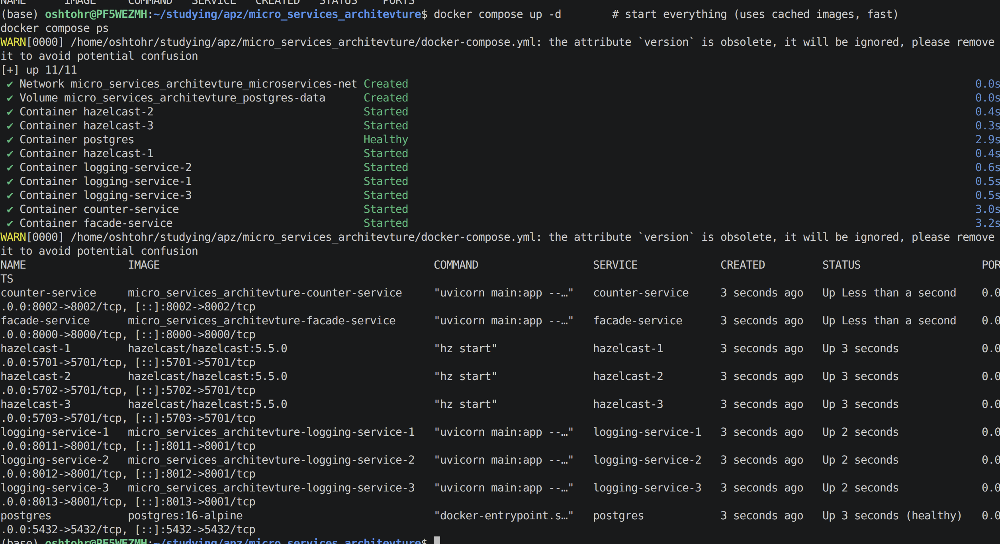

### Hazelcast cluster formed:
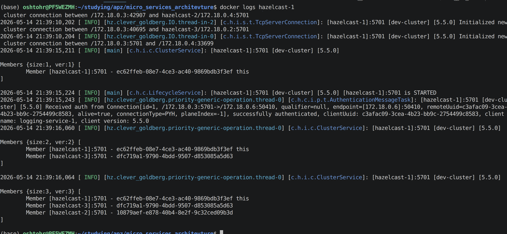

###  Each logging-service pinned to its own HZ node:
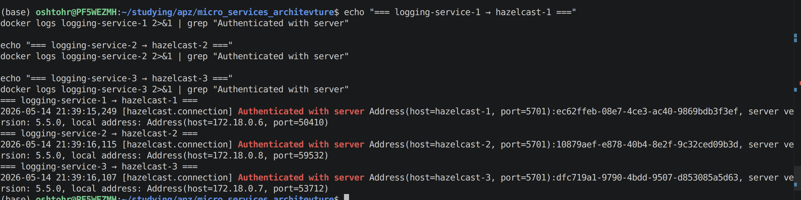

### POST 10 transactions:
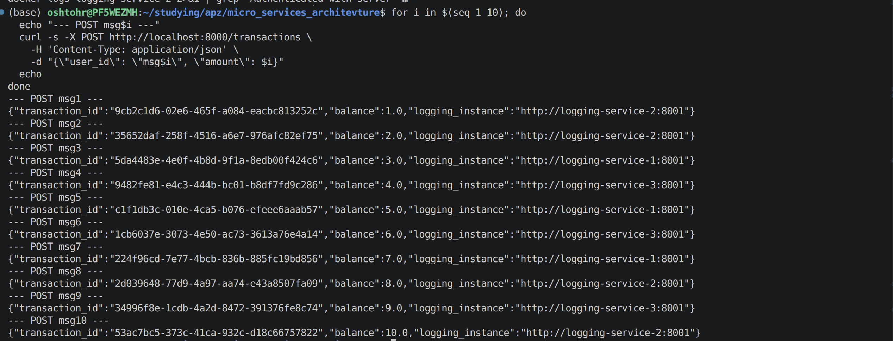

### Which message landed on which logging-service:
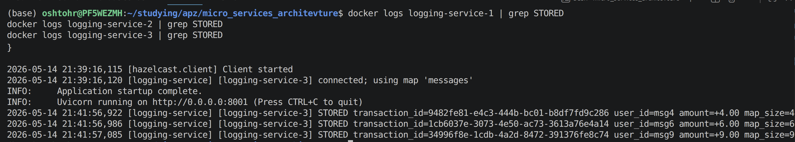

### GET reads back all 10
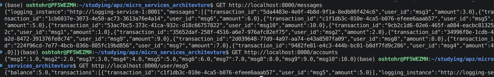

### Fault tolerance - logging-service instances:
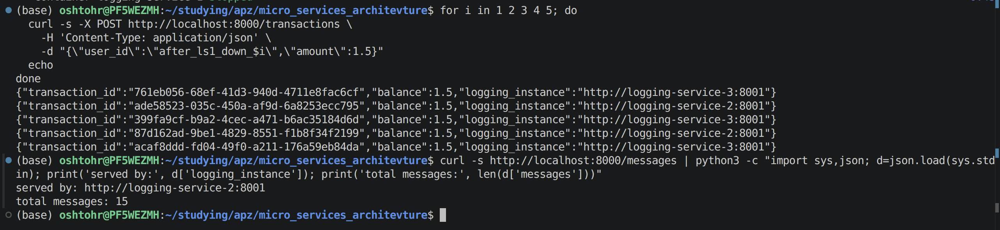
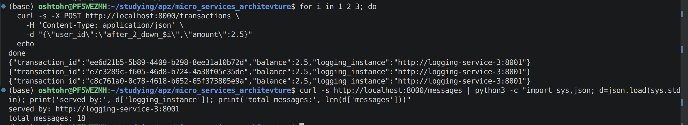

### Fault tolerance — Hazelcast nodes:
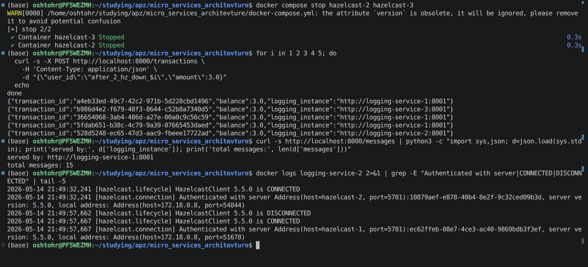

### Postgres persistence
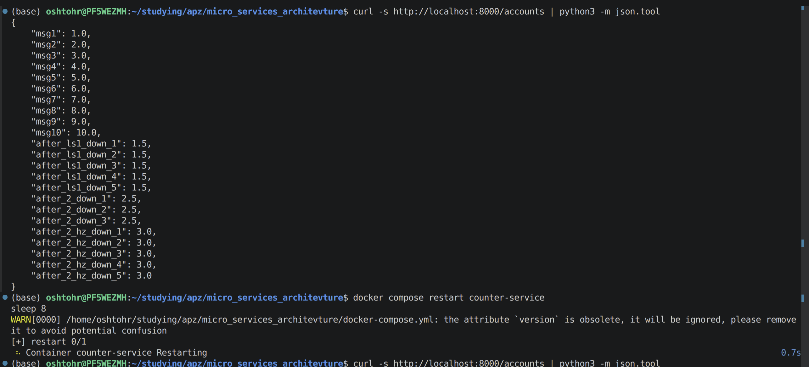
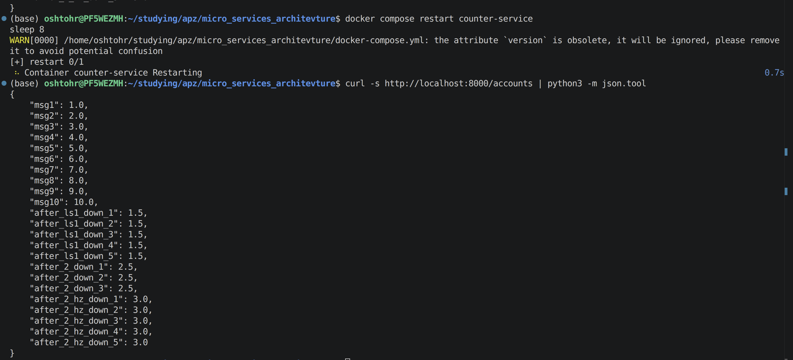